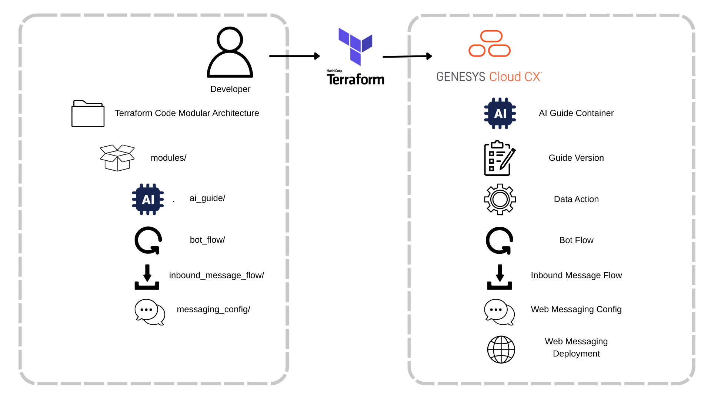
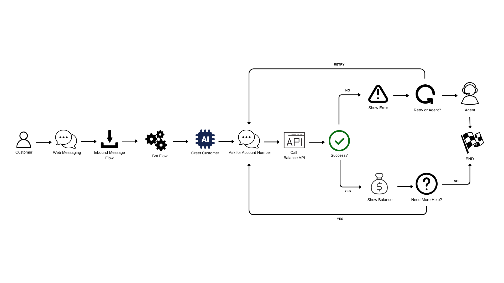

# Deploy AI Guides using Terraform and CX as Code

> View the full [Deploy AI Guides using Terraform and CX as Code](https://developer.genesys.cloud/blueprints/) article on the Genesys Cloud Developer Center.

This Genesys Cloud Developer Blueprint demonstrates how to deploy AI Guides using Terraform and the Genesys Cloud CX as Code provider. AI Guides enable business users to create AI-powered Virtual Agents using natural language instructions, and this blueprint shows how to manage them as code for version control, automation, and consistent deployments across environments.



## Use Case Flow



## Quick Start

```bash
# Clone the repository
git clone https://github.com/GiLLBaTesx/deploy-ai-guides-terraform-blueprint.git
cd deploy-ai-guides-terraform-blueprint/blueprint/terraform

# Configure environment variables
cp .env.example .env
# Edit .env with your Genesys Cloud OAuth credentials

# Load environment variables
source .env

# Deploy
terraform init
terraform plan
terraform apply
```

## What Gets Deployed

This blueprint deploys:
1. **AI Guide Container** - "Check Account Balance" guide
2. **Guide Version** - Complete guide with instructions, variables, and data action references
3. **Data Action** - Integration action for retrieving account balance from backend API

## Use Case

The blueprint implements a "Check Account Balance" AI Guide that:
* Accepts customer account number as input
* Calls a backend API via data action to retrieve balance
* Returns the current balance to the bot flow
* Handles error scenarios gracefully

This follows AI Guides best practices for single-intent guides.

## Guide Instructions

AI Guide instructions are stored as markdown files in the `blueprint/terraform/guides/` directory. This approach provides:
* **Version control** - Track changes to guide logic with meaningful diffs
* **Collaboration** - Business users can edit instructions without touching Terraform code
* **Maintainability** - Separate guide content from infrastructure configuration
* **Reusability** - Easy to create multiple guide versions or variants

The `account-balance-guide.md` file contains natural language instructions that define the guide's conversational flow, including greeting, data collection, API calls, error handling, and conversation closure.

## Prerequisites

* Genesys Cloud organization with AI Experience license
* Terraform v1.0 or later
* OAuth client with appropriate permissions
* Web Services Data Actions integration

## Additional Resources

* [Complete Blueprint Documentation](blueprint/index.md)
* [AI Guides Overview](https://help.mypurecloud.com/articles/ai-guides-overview/)
* [CX as Code Documentation](https://developer.genesys.cloud/devapps/cx-as-code/)
* [Genesys Cloud Terraform Provider](https://registry.terraform.io/providers/MyPureCloud/genesyscloud/latest/docs)
