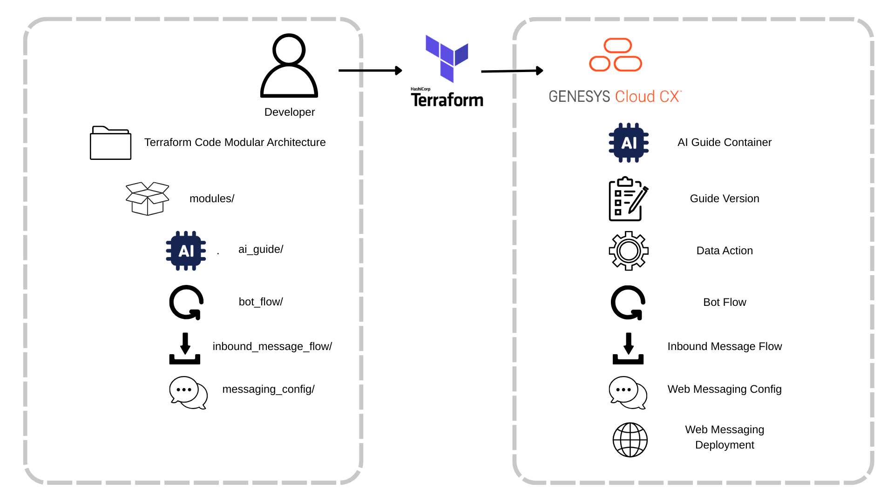
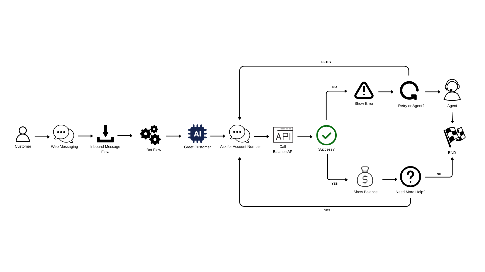

This Genesys Cloud Developer Blueprint demonstrates how to deploy AI Guides using Terraform and the Genesys Cloud CX as Code provider. AI Guides enable business users to create AI-powered Virtual Agents using natural language instructions, and this blueprint shows how to manage them as code for version control, automation, and consistent deployments across environments.



## Scenario

An organization wants to deploy AI Guides programmatically to:
* Version control guide instructions alongside infrastructure code
* Deploy guides consistently across dev, test, and production environments
* Automate guide deployments through CI/CD pipelines
* Track changes with full audit history

This blueprint uses the "Check Account Balance" use case - a recommended single-intent guide from AI Guides best practices.



## Solution

This blueprint demonstrates a complete AI Guide solution that deploys 7 resources:

1. **AI Guide Container** - The guide definition
2. **Guide Version** - Guide logic with instructions and variables
3. **Data Action** - Backend API integration
4. **Bot Flow** - Conversation flow that calls the AI Guide
5. **Inbound Message Flow** - Routes incoming messages to the bot
6. **Web Messaging Configuration** - Messenger interface settings
7. **Web Messaging Deployment** - Deploys messenger to your website

The blueprint shows how to:
* Define AI Guides using Terraform resources (`genesyscloud_guide` and `genesyscloud_guide_version`)
* Store guide instructions in markdown files for version control
* Configure input/output variables for guides
* Create data actions that guides can reference
* Deploy guides across multiple environments using environment variables
* Implement a modular Terraform architecture for maintainability

## Contents

* [Solution components](#solution-components "Goes to the Solution components section")
* [Prerequisites](#prerequisites "Goes to the Prerequisites section")
* [Implementation steps](#implementation-steps "Goes to the Implementation steps section")
* [Test the complete solution](#test-the-complete-solution "Goes to the Test the complete solution section")
* [Terraform resources for AI Guides](#terraform-resources-for-ai-guides "Goes to the Terraform resources section")
* [Understanding the guide structure](#understanding-the-guide-structure "Goes to the Understanding the guide structure section")
* [Complex schemas and required fields](#complex-schemas-and-required-fields "Goes to the Complex schemas section")
* [Best practices](#best-practices "Goes to the Best practices section")
* [Running Terraform](#running-terraform "Goes to the Running Terraform section")
* [Advanced patterns](#advanced-patterns "Goes to the Advanced patterns section")
* [Troubleshooting](#troubleshooting "Goes to the Troubleshooting section")
* [Additional resources](#additional-resources "Goes to the Additional resources section")

## Solution components

* **Genesys Cloud** - A suite of Genesys Cloud services for enterprise-grade communications, collaboration, and contact center management.
* **Genesys Cloud AI Studio** - Platform for building and managing AI capabilities including AI Guides.
* **Terraform** - Infrastructure as code tool for building, changing, and versioning infrastructure safely and efficiently.
* **CX as Code** - Genesys Cloud Terraform provider for managing Genesys Cloud configuration.

## Prerequisites

### Specialized knowledge

* Administrator-level knowledge of Genesys Cloud
* Experience with Terraform and infrastructure as code concepts
* Familiarity with AI Guides and Virtual Agents

### Genesys Cloud account

* A Genesys Cloud license. For more information, see [Genesys Cloud Pricing](https://www.genesys.com/pricing "Opens the Genesys Cloud pricing page") in the Genesys website.
* Genesys Cloud AI Experience license
* Virtual Agent enabled in your organization
* AI Studio permissions
* Master Admin role or equivalent permissions. For more information, see [Roles and permissions overview](https://help.mypurecloud.com/?p=24360 "Opens the Roles and permissions overview article") in the Genesys Cloud Resource Center.

### Development tools

* Terraform (v1.0 or later). For more information, see [Download Terraform](https://www.terraform.io/downloads.html "Opens the Download Terraform page") in the Terraform website.
* Git

## Implementation steps

### Clone the repository

Clone the [deploy-ai-guides-terraform-blueprint](https://github.com/GiLLBaTesx/deploy-ai-guides-terraform-blueprint "Opens the project repository on GitHub") repository from GitHub:

```bash
git clone https://github.com/GiLLBaTesx/deploy-ai-guides-terraform-blueprint.git
cd deploy-ai-guides-terraform-blueprint
```

### Set up Genesys Cloud OAuth credentials

1. Navigate to **Admin > Integrations > OAuth** in Genesys Cloud
2. Click **Add Client**
3. Configure the OAuth client:
   * **App Name**: Terraform AI Guides
   * **Grant Type**: Client Credentials
   * **Roles**: Assign the following roles:
     - `knowledge:guide:add`
     - `knowledge:guide:edit`
     - `knowledge:guide:view`
     - `integrations:integration:view`
     - `integrations:action:add`
     - `integrations:action:edit`
4. Click **Save** and note the Client ID and Client Secret

### Get Integration ID

1. Navigate to **Admin > Integrations > Integrations**
2. Find or create a Web Services Data Actions integration
3. Click on the integration and copy its ID from the URL

### Configure environment variables

1. Navigate to the terraform directory:
```bash
cd blueprint/terraform
```

2. Copy the example environment file:
```bash
cp .env.example .env
```

3. Edit `.env` and add your credentials:
```bash
# Genesys Cloud Provider Environment Variables
GENESYSCLOUD_OAUTHCLIENT_ID=your-client-id
GENESYSCLOUD_OAUTHCLIENT_SECRET=your-client-secret
GENESYSCLOUD_REGION=your-region-here  # e.g., us-east-1, eu-west-1, ap-southeast-2

# Terraform Variables for Resources
TF_VAR_integration_id=your-integration-id
TF_VAR_api_base_url=https://api.example.com
TF_VAR_environment=dev
```

4. Load the environment variables:
```bash
source .env
```

### Initialize and deploy with Terraform

1. Initialize Terraform:
```bash
terraform init
```

2. Review the deployment plan:
```bash
terraform plan
```

The plan will show 7 resources to be created:
- AI Guide container
- Guide version with instructions and variables
- Data action for account balance retrieval
- Bot flow
- Inbound message flow
- Web messaging configuration
- Web messaging deployment

3. Apply the configuration:
```bash
terraform apply
```

4. Type `yes` when prompted to confirm the deployment

5. Note the output values:
```
Outputs:

data_action_id = "xxxxxxxx-xxxx-xxxx-xxxx-xxxxxxxxxxxx"
guide_id = "xxxxxxxx-xxxx-xxxx-xxxx-xxxxxxxxxxxx"
guide_name = "Check Account Balance"
guide_version_id = "xxxxxxxx-xxxx-xxxx-xxxx-xxxxxxxxxxxx"
```

### Verify the deployment

1. Log into Genesys Cloud
2. Navigate to **Admin > AI Studio > Guides**
3. Verify that "Check Account Balance" guide appears in the list
4. Click on the guide to review:
   * Guide instructions from the markdown file
   * Input variable: `account_number`
   * Output variable: `current_balance`
   * Data action reference: "Get Account Balance"

### Test the complete solution

1. Get the web messaging deployment snippet:
   * Navigate to **Admin > Message > Messenger Deployments**
   * Find your deployment (output from terraform apply)
   * Copy the deployment snippet
   * Add it to your website's HTML

2. Test the end-to-end flow:
   * Open your website with the messenger snippet
   * Click the messenger button to start a conversation
   * Type an account number (e.g., "12345")
   * Verify the bot responds with the account balance

3. Test error scenarios:
   * Invalid account number
   * API timeout or unavailability
   * Network errors

**Expected behavior**:
- Bot greets the customer via inbound message flow
- Bot routes to the bot flow
- Bot flow calls the AI Guide
- Guide collects account number
- Guide executes data action to retrieve balance
- Guide returns balance to bot flow
- Bot displays the balance to customer
- Errors are handled gracefully with appropriate messages

## Terraform resources for AI Guides

To provision a complete AI Guide solution in Genesys Cloud, you need to understand the required Terraform resources and their relationships.

### Required resources

This blueprint uses the following Terraform resources from the Genesys Cloud provider:

1. **`genesyscloud_guide`** - Creates the AI Guide container
2. **`genesyscloud_guide_version`** - Defines the guide logic, instructions, and variables
3. **`genesyscloud_integration_action`** - Creates data actions for API calls
4. **`genesyscloud_flow`** - Creates bot flows and inbound message flows
5. **`genesyscloud_webdeployments_configuration`** - Configures web messaging
6. **`genesyscloud_webdeployments_deployment`** - Deploys web messaging to websites

### Resource dependencies

The resources must be created in a specific order due to dependencies:

```
genesyscloud_guide (AI Guide Container)
    ↓
genesyscloud_guide_version (requires guide_id)
    ↓
genesyscloud_flow (Bot Flow - references guide_id)
    ↓
genesyscloud_flow (Inbound Message Flow - references bot flow)
    ↓
genesyscloud_webdeployments_configuration (references inbound flow)
    ↓
genesyscloud_webdeployments_deployment (references configuration)
```

Terraform automatically handles these dependencies when you use resource references (e.g., `genesyscloud_guide.account_balance_guide.id`).

## Understanding the guide structure

AI Guides in Terraform use a two-resource model for versioning:

### Guide Container (`genesyscloud_guide`)

The guide resource creates a container with just a name:

```hcl
resource "genesyscloud_guide" "account_balance_guide" {
  name = "Check Account Balance"
}
```

This container holds all versions of your guide, enabling version management and rollback capabilities.

### Guide Version (`genesyscloud_guide_version`)

The guide version contains all the logic and is where you define:

**Instructions**: Natural language steps that define your guide's behavior
- Use markdown formatting for readability
- Use headings (`##`) to define steps
- Reference variables with `$variable_name` syntax
- Reference data actions with `/data_action_label/` syntax
- Use commands like: Say, Ask, Call, Store, Go To, If/Then/Else, Exit

**Variables**: Define input, output, and internal variables

```hcl
variables {
  name        = "account_number"
  type        = "String"
  scope       = "Input"
  description = "Customer's account number"
}
```

Variable scopes:
- `Input` - Receives value from Architect flow
- `Output` - Returns value to Architect flow
- `InputAndOutput` - Both input and output
- `Internal` - Used only within the guide

**Data Actions**: Reference existing data actions

```hcl
resources {
  data_action {
    data_action_id = genesyscloud_integration_action.get_account_balance.id
    label          = "Get Account Balance"
    description    = "Retrieves customer account balance"
  }
}
```

The `label` is how you reference the data action in your instructions using `/label/` syntax.

## Complex schemas and required fields

### Guide version schema complexity

The `genesyscloud_guide_version` resource has several complex nested blocks that require careful configuration:

#### Variables block (Required)

Each variable must include:

| Field | Required | Type | Description |
|-------|----------|------|-------------|
| `name` | Yes | String | Variable identifier used in instructions (case-sensitive) |
| `type` | Yes | String | Data type: `String`, `Number`, `Boolean`, or `Object` |
| `scope` | Yes | String | Variable scope: `Input`, `Output`, `InputAndOutput`, or `Internal` |
| `description` | No | String | Explains the variable's purpose (recommended for documentation) |

**Example with all fields:**
```hcl
variables {
  name        = "account_number"
  type        = "String"
  scope       = "Input"
  description = "Customer's account number for balance lookup"
}

variables {
  name        = "current_balance"
  type        = "String"
  scope       = "Output"
  description = "Current account balance returned to bot flow"
}
```

**Common mistakes:**
- ❌ Variable name in instructions doesn't match definition (case-sensitive)
- ❌ Wrong scope (using `Internal` when value needs to come from bot flow)
- ❌ Missing required fields (`name`, `type`, or `scope`)

#### Resources block (Optional but recommended)

The resources block references data actions that the guide can call:

| Field | Required | Type | Description |
|-------|----------|------|-------------|
| `data_action_id` | Yes | String | ID of the `genesyscloud_integration_action` resource |
| `label` | Yes | String | How you reference the action in instructions (use `/label/` syntax) |
| `description` | No | String | Explains what the action does |

**Example:**
```hcl
resources {
  data_action {
    data_action_id = genesyscloud_integration_action.get_account_balance.id
    label          = "Get Account Balance"
    description    = "Retrieves customer account balance from backend system"
  }
}
```

**Common mistakes:**
- ❌ Label in instructions doesn't match label in resource block
- ❌ Forgetting to use `/label/` syntax in instructions
- ❌ Data action ID references wrong resource

#### Instruction field (Required)

The `instruction` field contains the guide's natural language logic:

**Best practice - Use external file:**
```hcl
instruction = file("${path.module}/guides/account-balance-guide.md")
```

**Why external files:**
- ✅ Better version control with meaningful diffs
- ✅ Easier collaboration with business users
- ✅ Avoids Terraform whitespace drift issues
- ✅ Cleaner Terraform code

**Avoid inline heredoc for large instructions:**
```hcl
# ❌ Not recommended for production
instruction = <<-EOT
  ## Step 1: Greeting
  Say "Hello! I can help you check your account balance."
  ...
EOT
```

### Data action schema complexity

The `genesyscloud_integration_action` resource uses JSON Schema for contracts:

#### Contract input (Required)

Defines what data the action expects:

```hcl
contract_input = jsonencode({
  type = "object"
  properties = {
    accountNumber = {
      type        = "string"
      description = "The account number to look up"
    }
  }
  required = ["accountNumber"]
})
```

**Key fields:**
- `type` - Always `"object"` for data actions
- `properties` - Object defining each input parameter
- `required` - Array of required parameter names

#### Contract output (Required)

Defines what data the action returns:

```hcl
contract_output = jsonencode({
  type = "object"
  properties = {
    balance = {
      type        = "string"
      description = "Current account balance"
    }
    currency = {
      type        = "string"
      description = "Currency code (e.g., USD)"
    }
  }
})
```

#### Request configuration (Required)

The `config_request` block defines the API call:

```hcl
config_request {
  request_url_template = "${var.api_base_url}/accounts/${input.accountNumber}/balance"
  request_type         = "GET"
  request_template     = "${input.rawRequest}"
}
```

**Key fields:**
- `request_url_template` - API endpoint with variable interpolation using `${input.parameterName}`
- `request_type` - HTTP method: `GET`, `POST`, `PUT`, `DELETE`, `PATCH`
- `request_template` - Request body template (required for POST/PUT)

#### Response configuration (Required)

The `config_response` block maps API responses:

```hcl
config_response {
  translation_map = {
    balance     = "$.balance.amount"
    currency    = "$.balance.currency"
    lastUpdated = "$.lastUpdated"
  }
  success_template = "${rawResult}"
}
```

**Key fields:**
- `translation_map` - JSONPath expressions to extract data from API response
- `success_template` - Template for successful responses (usually `"${rawResult}"`)

**JSONPath examples:**
- `$.balance.amount` - Extracts nested value
- `$.items[0].name` - Extracts first array element
- `$.data.*` - Extracts all properties from data object

## Best practices

### 1. Use the two-resource model for versioning

Always create separate guide container and version resources:

```hcl
# Container - holds all versions
resource "genesyscloud_guide" "support_guide" {
  name = "Customer Support Guide"
}

# Version 1.0
resource "genesyscloud_guide_version" "support_v1" {
  guide_id    = genesyscloud_guide.support_guide.id
  instruction = file("${path.module}/guides/support-v1.md")
  # ... variables and resources
}
```

**Why:** Enables version management, rollback capabilities, and A/B testing.

### 2. Store guide instructions in external files

```hcl
# ✅ Recommended
instruction = file("${path.module}/guides/account-balance-guide.md")

# ❌ Avoid for production
instruction = <<-EOT
  ## Step 1
  ...
EOT
```

**Benefits:**
- Better version control with meaningful diffs
- Business users can edit without touching Terraform
- Avoids whitespace drift in Terraform state
- Cleaner, more maintainable code

### 3. Use environment variables for credentials

Never hardcode credentials in Terraform files:

```bash
# .env file (never commit this)
export GENESYSCLOUD_OAUTHCLIENT_ID="your-client-id"
export GENESYSCLOUD_OAUTHCLIENT_SECRET="your-client-secret"
export GENESYSCLOUD_REGION="us-east-1"
```

The Genesys Cloud provider automatically reads these environment variables.

### 4. Implement modular architecture

Organize resources into reusable modules:

```
terraform/
├── main.tf
├── variables.tf
└── modules/
    ├── ai_guide/
    ├── bot_flow/
    ├── inbound_message_flow/
    └── messaging_config/
```

**Benefits:**
- Reusable across projects
- Easier to maintain and test
- Cleaner main configuration
- Better separation of concerns

### 5. Follow single-intent guide pattern

Each guide should focus on one specific task:
- ✅ Good: "Check Account Balance"
- ✅ Good: "Update Shipping Address"
- ❌ Bad: "Account Management" (too broad)

**Why:** Single-intent guides are easier to maintain, more reusable, and provide better user experience.

### 6. Use descriptive variable names

```hcl
# ✅ Good - self-documenting
variables {
  name = "account_number"
  type = "String"
  scope = "Input"
}

# ❌ Bad - unclear purpose
variables {
  name = "var1"
  type = "String"
  scope = "Input"
}
```

### 7. Add comprehensive error handling

Always include error handling in guide instructions:

```markdown
## Error Handling

If the data action fails:

"I'm sorry, but I couldn't retrieve your account information. Please try again, or I can transfer you to a customer service representative."

Ask if they want to:
- Try again (return to Step 1)
- Speak with a representative (transfer to human agent)
```

### 8. Validate JSON schemas

Ensure your data action contracts are valid:
- Include all required fields
- Use appropriate data types
- Add descriptions for documentation
- Test with actual API responses

### 9. Use Terraform outputs

Define outputs for important resource IDs:

```hcl
output "guide_id" {
  value       = genesyscloud_guide.account_balance_guide.id
  description = "The ID of the created AI Guide"
}
```

**Why:** Makes it easy to reference resources in other configurations or for testing.

### 10. Implement proper dependency management

Use `depends_on` when implicit dependencies aren't sufficient:

```hcl
module "bot_flow" {
  source = "./modules/bot_flow"
  guide_id = module.ai_guide.guide_id
  
  depends_on = [module.ai_guide]
}
```

## Running Terraform

### Complete workflow

#### Step 1: Set up environment variables

Create a `.env` file (add to `.gitignore`):

```bash
# Genesys Cloud Provider Environment Variables
export GENESYSCLOUD_OAUTHCLIENT_ID="your-client-id"
export GENESYSCLOUD_OAUTHCLIENT_SECRET="your-client-secret"
export GENESYSCLOUD_REGION="us-east-1"

# Terraform Variables for Resources
export TF_VAR_integration_id="your-integration-id"
export TF_VAR_api_base_url="https://api.example.com"
export TF_VAR_environment="dev"
```

Load the variables:
```bash
source .env
```

#### Step 2: Initialize Terraform

```bash
terraform init
```

**What happens:**
- Downloads the Genesys Cloud provider plugin
- Initializes the backend (local state by default)
- Creates `.terraform/` directory
- Creates `.terraform.lock.hcl` lock file

**Expected output:**
```
Initializing the backend...
Initializing provider plugins...
- Finding latest version of mypurecloud/genesyscloud...
- Installing mypurecloud/genesyscloud v1.x.x...

Terraform has been successfully initialized!
```

#### Step 3: Validate configuration

```bash
terraform validate
```

**What it checks:**
- Syntax errors in `.tf` files
- Required arguments present
- Valid resource types
- Proper variable references

**Expected output:**
```
Success! The configuration is valid.
```

#### Step 4: Format code

```bash
terraform fmt -recursive
```

**What it does:**
- Formats all `.tf` files to Terraform standard style
- Ensures consistent indentation and spacing
- Makes code reviews easier

#### Step 5: Plan the deployment

```bash
terraform plan
```

**What it shows:**
- Resources to be created (+)
- Resources to be modified (~)
- Resources to be destroyed (-)
- Total count of changes

**Expected output for this blueprint:**
```
Terraform will perform the following actions:

  # module.ai_guide.genesyscloud_guide.account_balance_guide will be created
  + resource "genesyscloud_guide" "account_balance_guide" {
      + id   = (known after apply)
      + name = "Check Account Balance"
    }

  # module.ai_guide.genesyscloud_guide_version.account_balance_v1 will be created
  + resource "genesyscloud_guide_version" "account_balance_v1" {
      + guide_id    = (known after apply)
      + id          = (known after apply)
      + instruction = (file content)
      ...
    }

  [... 5 more resources ...]

Plan: 7 to add, 0 to change, 0 to destroy.
```

**Review checklist:**
- ✅ Correct number of resources (7 for this blueprint)
- ✅ Resource names are correct
- ✅ No unexpected deletions
- ✅ Variable values are correct

#### Step 6: Apply the configuration

```bash
terraform apply
```

Terraform will show the plan again and prompt for confirmation. Type `yes` to proceed.

**What happens:**
- Creates resources in dependency order
- Stores resource IDs in state file
- Displays outputs when complete

**Expected output:**
```
module.ai_guide.genesyscloud_guide.account_balance_guide: Creating...
module.ai_guide.genesyscloud_guide.account_balance_guide: Creation complete after 2s [id=abc123...]

module.ai_guide.genesyscloud_integration_action.get_account_balance: Creating...
module.ai_guide.genesyscloud_integration_action.get_account_balance: Creation complete after 3s [id=def456...]

module.ai_guide.genesyscloud_guide_version.account_balance_v1: Creating...
module.ai_guide.genesyscloud_guide_version.account_balance_v1: Creation complete after 4s [id=ghi789...]

[... 4 more resources ...]

Apply complete! Resources: 7 added, 0 changed, 0 destroyed.

Outputs:

guide_id = "abc123..."
guide_name = "Check Account Balance"
guide_version_id = "ghi789..."
data_action_id = "def456..."
bot_flow_id = "jkl012..."
inbound_message_flow_id = "mno345..."
messaging_deployment_id = "pqr678..."
```

#### Step 7: Verify the state

Check what Terraform created:

```bash
# Show all resources
terraform show

# Show specific resource
terraform state show module.ai_guide.genesyscloud_guide.account_balance_guide

# List all resources
terraform state list
```

### Making changes

When you need to update the configuration:

1. Modify your `.tf` files or guide instruction files
2. Run `terraform plan` to preview changes
3. Run `terraform apply` to apply changes

**Example output for changes:**
```
Plan: 0 to add, 1 to change, 0 to destroy.
```

### Destroying resources

To remove all resources (use with caution):

```bash
terraform destroy
```

**When to use:**
- Cleaning up test environments
- Removing deprecated guides
- Starting fresh

**Warning:** This will delete all resources managed by Terraform. Always run `terraform plan -destroy` first to preview what will be deleted.

### Common Terraform commands

| Command | Purpose |
|---------|---------|
| `terraform init` | Initialize working directory |
| `terraform validate` | Check configuration syntax |
| `terraform fmt` | Format code to standard style |
| `terraform plan` | Preview changes |
| `terraform apply` | Create/update resources |
| `terraform destroy` | Delete all resources |
| `terraform show` | Display current state |
| `terraform state list` | List all resources |
| `terraform output` | Display output values |
| `terraform refresh` | Sync state with real resources |

## Advanced patterns

### Versioning guides

The two-resource model enables proper versioning:

```hcl
resource "genesyscloud_guide" "support_guide" {
  name = "Customer Support Guide"
}

# Version 1.0
resource "genesyscloud_guide_version" "support_v1" {
  guide_id    = genesyscloud_guide.support_guide.id
  instruction = file("${path.module}/guides/support-v1.md")
  # ... variables and resources
}

# Version 2.0 with improvements
resource "genesyscloud_guide_version" "support_v2" {
  guide_id    = genesyscloud_guide.support_guide.id
  instruction = file("${path.module}/guides/support-v2.md")
  # ... updated variables and resources
}
```

### Multi-environment deployment

Use Terraform workspaces or variables to manage guides across environments:

```hcl
resource "genesyscloud_guide" "support_guide" {
  name = "Customer Support - ${var.environment}"
}

resource "genesyscloud_guide_version" "support_v1" {
  guide_id    = genesyscloud_guide.support_guide.id
  instruction = templatefile("${path.module}/guides/support-guide.md", {
    environment  = var.environment
    api_endpoint = var.api_endpoints[var.environment]
  })
  # ... variables and resources
}
```

### Modular guide design

Keep your guide instructions in separate markdown files for better maintainability:

```hcl
resource "genesyscloud_guide_version" "account_balance_v1" {
  guide_id    = genesyscloud_guide.account_balance_guide.id
  instruction = file("${path.module}/guides/account-balance-guide.md")
  
  # Variables and resources...
}
```

This approach provides:
- Better version control with meaningful diffs
- Easier collaboration with business users
- Cleaner Terraform code

### CI/CD integration

Integrate with your CI/CD pipeline for automated deployments:

```yaml
# .github/workflows/deploy-guides.yml
name: Deploy AI Guides

on:
  push:
    branches: [main]

jobs:
  deploy:
    runs-on: ubuntu-latest
    steps:
      - uses: actions/checkout@v2
      - uses: hashicorp/setup-terraform@v1
      
      - name: Terraform Init
        run: terraform init
        working-directory: blueprint/terraform
        
      - name: Terraform Apply
        run: terraform apply -auto-approve
        working-directory: blueprint/terraform
        env:
          GENESYSCLOUD_OAUTHCLIENT_ID: ${{ secrets.GENESYS_CLIENT_ID }}
          GENESYSCLOUD_OAUTHCLIENT_SECRET: ${{ secrets.GENESYS_CLIENT_SECRET }}
          GENESYSCLOUD_REGION: ${{ secrets.GENESYS_REGION }}
```

## Troubleshooting

### Guide not appearing in AI Studio

**Problem**: After running `terraform apply`, the guide doesn't appear in AI Studio.

**Solutions**:
- Verify AI Studio permissions are granted to your OAuth client
- Check that Virtual Agent is enabled in your organization
- Ensure you're using the latest version of the Terraform provider
- Confirm the guide was created: `terraform state show genesyscloud_guide.account_balance_guide`

### "Resource Not Found" error

**Problem**: Terraform returns a 404 error when trying to create or read a guide.

**Solutions**:
- Confirm AI Guides feature is available in your Genesys Cloud region
- Verify your OAuth client has all required permissions
- Check that `guide_id` references are correct in guide version resources
- Ensure the Terraform provider version supports AI Guides resources

### Variables not working in guide

**Problem**: Variables aren't being populated or passed correctly during guide execution.

**Solutions**:
- Ensure variable names in instructions match the variable definitions exactly (case-sensitive)
- Check that variable scope is appropriate:
  - Use `Input` for values from Architect flow
  - Use `Output` for values returned to Architect flow
  - Use `Internal` for values used only within the guide
- Verify variable types match the data being stored (String, Number, Boolean, Object)
- Use `$variable_name` syntax in instructions

### Data action not found

**Problem**: Guide can't find or execute the referenced data action.

**Solutions**:
- Verify the data action exists and is published
- Check that `data_action_id` matches the actual data action resource ID
- Ensure the `label` in the resource block matches how you reference it in instructions (use `/label/` syntax)
- Confirm the data action's integration is active and configured correctly

### Permission denied errors

**Problem**: OAuth client lacks permissions to create or modify guides.

**Solutions**:
- Review the complete permissions list in the Prerequisites section
- Ensure OAuth client has been granted all necessary permissions:
  - `knowledge:guide:add`
  - `knowledge:guide:edit`
  - `knowledge:guide:view`
  - `integrations:integration:view`
  - `integrations:action:add`
  - `integrations:action:edit`
- Verify the OAuth client role has AI Studio permissions enabled

### Terraform state issues

**Problem**: Terraform shows resources as changed when nothing has changed.

**Solutions**:
- This can happen with instruction formatting. Use `file()` function to load instructions from external files
- Avoid inline heredoc (`<<-EOT`) for large instructions as whitespace can cause drift
- Use `terraform refresh` to sync state with actual resources
- Consider using `lifecycle { ignore_changes = [instruction] }` if instructions are managed outside Terraform

## Additional resources

* [AI Guides Overview](https://help.mypurecloud.com/articles/ai-guides-overview/ "Opens the AI Guides Overview article") in the Genesys Cloud Resource Center
* [CX as Code Documentation](https://developer.genesys.cloud/devapps/cx-as-code/ "Opens the CX as Code page") in the Genesys Cloud Developer Center
* [Genesys Cloud Terraform Provider](https://registry.terraform.io/providers/MyPureCloud/genesyscloud/latest/docs "Opens the Genesys Cloud provider documentation") on the Terraform Registry
* [Genesys Cloud Terraform Provider - Guide Resource](https://registry.terraform.io/providers/MyPureCloud/genesyscloud/latest/docs/resources/guide "Opens the guide resource documentation") on the Terraform Registry
* [Genesys Cloud Terraform Provider - Guide Version Resource](https://registry.terraform.io/providers/MyPureCloud/genesyscloud/latest/docs/resources/guide_version "Opens the guide version resource documentation") on the Terraform Registry
* [Terraform Documentation](https://www.terraform.io/docs "Opens the Terraform documentation") on the Terraform website
* The [deploy-ai-guides-terraform-blueprint](https://github.com/GiLLBaTesx/deploy-ai-guides-terraform-blueprint "Opens the project repository on GitHub") repository on GitHub
